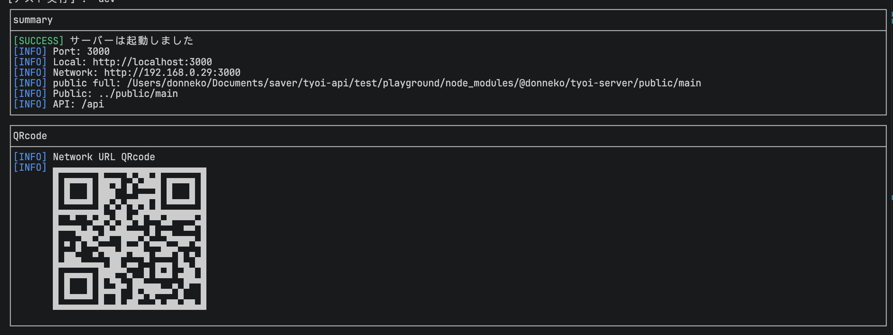

# tyoi-server

 

小さな API と静的ファイル配信をすぐに立てるための、ローカル向けサーバーフレームワークです。
CLI でテンプレートを作り、HTML / CSS / API / WebSocket の動作確認をすばやく始められます。



> This project is experimental. APIs may change in future releases.

## Features

- Express ベースの API / 静的ファイル配信
- JavaScript / TypeScript テンプレート
- WebSocket 対応
- Local / Network URL 表示
- LAN 公開、QR Code 表示、ブラウザ自動起動
- 使用中ポートの自動切り替え
- Express middleware と設定ファイル対応

## Quick Start

TypeScript テンプレートで始める場合:

```bash
npm exec --package @donneko/tyoi-server tyoi -- create my-app --template basic-ts
cd my-app
npm install
npm run dev
```

JavaScript テンプレートで始める場合:

```bash
npm exec --package @donneko/tyoi-server tyoi -- create my-app --template basic-js
cd my-app
npm install
npm run dev
```

起動後、表示された Local URL をブラウザで開くと、`public/main` のページを確認できます。

今いるディレクトリにテンプレートを作る場合は `init` を使います。

```bash
mkdir my-app
cd my-app
npm exec --package @donneko/tyoi-server tyoi -- init my-app --template basic-ts
npm install
npm run dev
```

## Programmatic Usage

コードから小さな API サーバーを作る場合は `tyoi()` を使えます。

```ts
import { tyoi } from "@donneko/tyoi-server";

const app = tyoi({
    baseDirname: import.meta.dirname,
    publicDirname: "../public/main",
    port: 3000
});

app.get("/hello", () => {
    return {
        message: "Hello Tyoi!"
    };
});

await app.start();
```

## Templates

- `basic-ts`: TypeScript 用テンプレート
- `basic-js`: JavaScript 用テンプレート

テンプレートを指定しない場合は、CLI 上で選択できます。

```bash
npm exec --package @donneko/tyoi-server tyoi -- create my-app
```

## Common CLI

作成済みプロジェクトでは、ローカルにインストールした `tyoi` を npm scripts から使えます。

```bash
tyoi create my-app --template basic-ts
tyoi init my-app --template basic-ts
tyoi config
tyoi info
tyoi run
tyoi run --port 3001
tyoi run --open
tyoi help
tyoi --version
```

主なコマンド:

- `tyoi create <name>`: 新しいフォルダにテンプレートを作成
- `tyoi init <name>`: 今いるフォルダにテンプレートを作成
- `tyoi config`: 今いるフォルダに `tyoi.config.js` を追加
- `tyoi info`: `tyoi run` で使われる設定を表示
- `tyoi run`: 現在のプロジェクトの設定でサーバーを起動
- `tyoi dev`: このパッケージの開発確認用サーバーを起動
- `tyoi help`: コマンド一覧を表示

## Docs

詳しい使い方は `docs/` に分けています。

- [Usage](./docs/usage.md): `tyoi()` の基本、API、WebSocket、middleware、イベント、`Server` 直接利用
- [Config](./docs/config.md): `tyoi.config.js` と設定項目
- [CLI](./docs/cli.md): CLI コマンドとオプション

## Development

このリポジトリを開発する場合:

```bash
npm install
npm test
npm run build
```

公開前には、公開パッケージに含まれるファイルを確認してください。

```bash
npm pack --dry-run
npm publish --dry-run
```

## License

MIT
